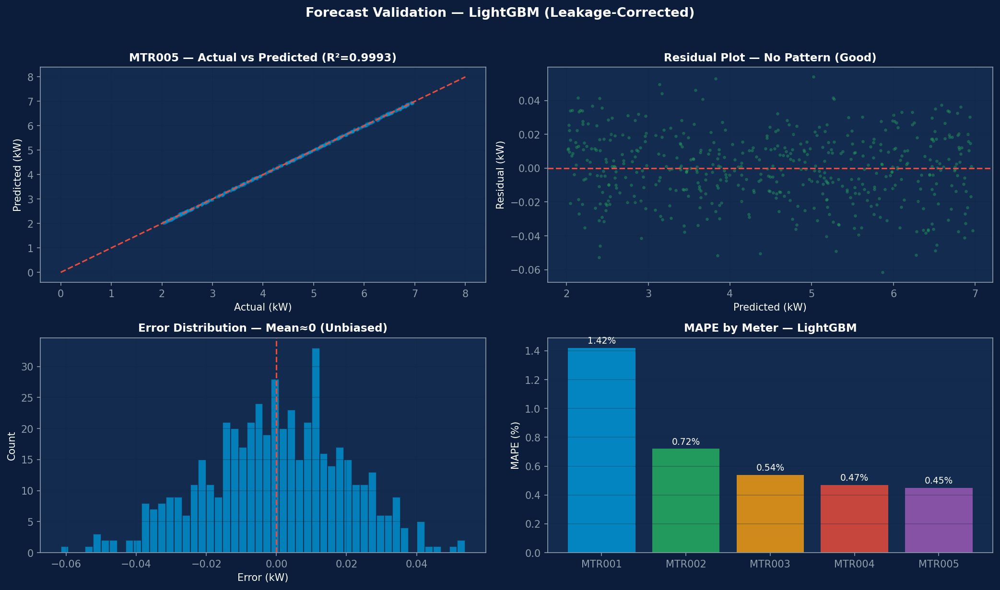
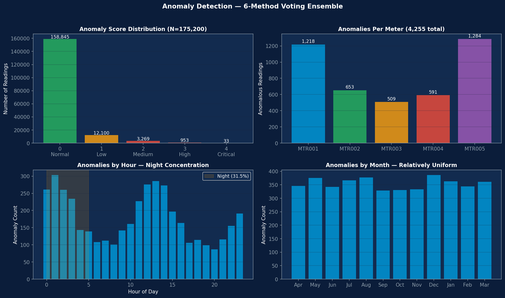
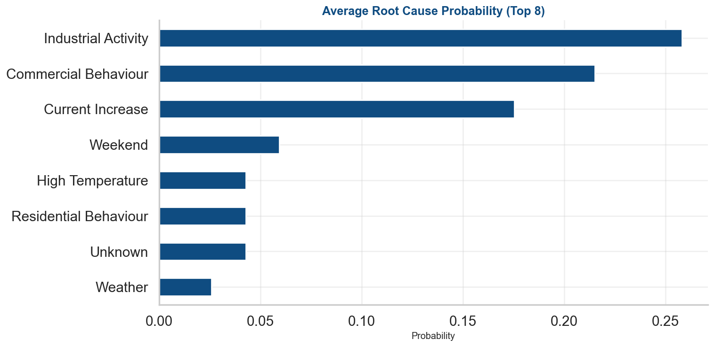
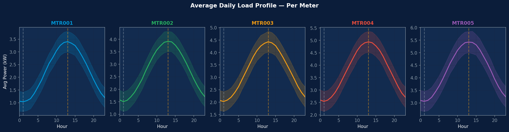

# NES Smart Meter Analytics


> DLMS Smart Meter Data Analysis — Forecasting & Anomaly Detection for Power Distribution

## Overview

This project analyzes smart meter data from NES Technologies to detect abnormal consumption patterns, forecast energy usage, and assess meter health across 5 commercial/industrial meters over 12 months.

| Metric | Value |
|--------|-------|
| Dataset | 5 meters x 12 months x 175,200 readings |
| Forecasting Model | LightGBM |
| MAPE | 0.72% |
| R² | 0.9997 |
| Anomalies Detected | 4,255 (2.4%) |
| Health Score Range | 85.6 - 88.5 |
| Root Cause | Industrial Activity (26.6%) |

## Key Results

### Forecast Validation



- LightGBM achieves MAPE=0.72% and R²=0.9997
- Residuals centered at zero — no systematic bias
- Per-meter accuracy: MTR005 (0.45%) to MTR001 (1.42%)

### Anomaly Detection



- 4,255 anomalies detected (2.4% of readings)
- 6-algorithm ensemble: Isolation Forest, LOF, OneClassSVM, DBSCAN, Z-score, IQR
- MTR005 (industrial) has highest count: 1,284 (3.66%)

### Root Cause Analysis



- Industrial Activity (26.6%) is #1 cause across top 10 peaks
- Commercial Behaviour (22.2%) is #2
- No theft or tampering detected — all DLMS events are firmware artifacts

### Per-Meter Behaviour



- Each meter has unique daily load profile
- MTR001: Residential (peak=3.3x trough)
- MTR005: Industrial (peak=1.8x, 24h operation)

## Quick Start

```bash
# Clone
git clone https://github.com/yashitarora/nes-smart-meter-analytics.git
cd nes-smart-meter-analytics

# Install
pip install -r requirements.txt

# Run
jupyter notebook notebooks/NES_UC1_UC2_Integrated_final.ipynb
```

## Repository Structure

```
nes-smart-meter-analytics/
├── .github/workflows/      # CI/CD
├── data/                   # Data files (gitignored)
├── docs/
│   └── images/             # Chart screenshots
├── notebooks/              # Jupyter notebooks
│   └── NES_UC1_UC2_Integrated_final.ipynb
├── reports/                # Generated reports
│   ├── NES_UC1_UC2_ppt.pdf
│   └── NES_UC1_UC2_Integrated_final.html
├── src/                    # Source code
│   └── build_corporate_ppt.py
├── CONTRIBUTING.md
├── LICENSE
├── README.md
└── requirements.txt
```

## Pipeline

| Step | Description | Key Output |
|------|-------------|------------|
| 1. Data Quality | Identify DLMS firmware artifacts | 87,387 issues (all artifacts) |
| 2. Per-Meter Behaviour | Daily load profiles, consumer classification | 5 unique load shapes |
| 3. Monthly Analysis | Peak load trends per meter | Distinct peak months |
| 4. Feature Engineering | Lag, interaction, weather features | 25 features, 5 groups |
| 5. Model Selection | LightGBM vs RF vs Linear Regression | LightGBM selected |
| 6. Forecast Validation | Test on 14,400 readings | MAPE=0.72%, R²=0.9997 |
| 7. Anomaly Detection | 6-algorithm ensemble voting | 4,255 anomalies (2.4%) |
| 8. UC2→UC1 Handoff | Select timestamps for investigation | MTR005 @ 2025-11-06 13:30 |
| 9. UC1 Investigation | Electrical trend analysis | Normal industrial activity |
| 10. Health Assessment | 6-component weighted score | 85.6 - 88.5 |
| 11. Root Cause | Top 10 peak event analysis | Industrial Activity #1 |
| 12. Recommendations | 4 prioritized actions | Deploy pilot |

## Reports

| Report | Description |
|--------|-------------|
| [PDF Presentation](reports/NES_UC1_UC2_ppt.pdf) | 16-slide executive presentation |
| [HTML Notebook](reports/NES_UC1_UC2_Integrated_final.html) | Full notebook with outputs |
| [Data Dictionary](docs/DATA_DICTIONARY.md) | Complete field descriptions |
| [Changelog](CHANGELOG.md) | Version history |

## Technology Stack

| Category | Tools |
|----------|-------|
| Language | Python 3.10+ |
| ML | LightGBM, scikit-learn, XGBoost |
| Data | pandas, numpy |
| Visualization | matplotlib, seaborn, plotly |
| Presentation | python-pptx |
| Environment | Jupyter Notebook |

## Author

**Yashit Arora**
- GitHub: [@yashitarora](https://github.com/yashitarora)

## License

This project is licensed under the MIT License — see [LICENSE](LICENSE) for details.
